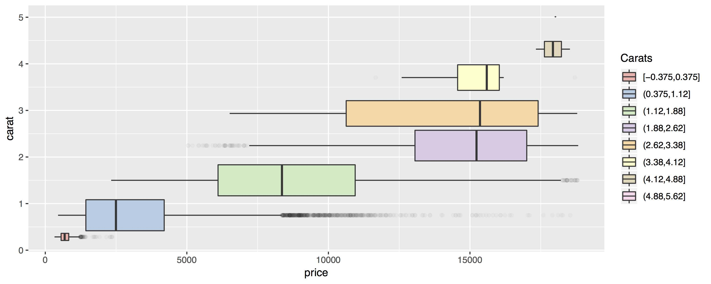

# Visualization Workshop Test

This is my first markdown file ever in Github.

I will include now some cool stuff to demonstrate how this markdown works.

The workshop was taught at ["Tecnológico de Monterrey"](https://tec.mx/es) Campus Estado de México.

The instructor name is ["Hector"](https://chipdelmal.github.io).

One of the diagrams we learnt about is the BoxWhiskerChart.

Here's an example:

<br>

Amazing, isn't it?

Now check out the code behind it:

```
##############################################################################
# Box-Whisker Chart
# ---------------------------------------------------------------------------
# Sources:
#   http://www.sthda.com/english/wiki/ggplot2-box-plot-quick-start-guide-r-software-and-data-visualization
#   https://ggplot2.tidyverse.org/reference/diamonds.html
#   https://ggplot2.tidyverse.org/reference/mpg.html
##############################################################################

install.packages("ggplot2")
library(ggplot2)
options(repr.plot.width=4, repr.plot.height=3)

#############################################################################
# Diamonds Initial draft
head(diamonds)
diamonds
p = ggplot(diamonds, aes(carat, price))
p = p + geom_boxplot(aes(group = cut_width(carat, 1)),notchwidth = 0.5)
p

# Flipping axes
p = p + coord_flip()

# Adjust the transparency of outliers using outlier.alpha, and add style
width=.75
p = ggplot(diamonds, aes(carat, price)) + scale_fill_brewer(palette="Pastel1") +
  geom_boxplot(aes(group = cut_width(carat, width),
                   fill=cut_width(carat, width)),
               outlier.alpha = .1) +
  coord_flip() + theme() + labs(fill = "Carats")
p

```
